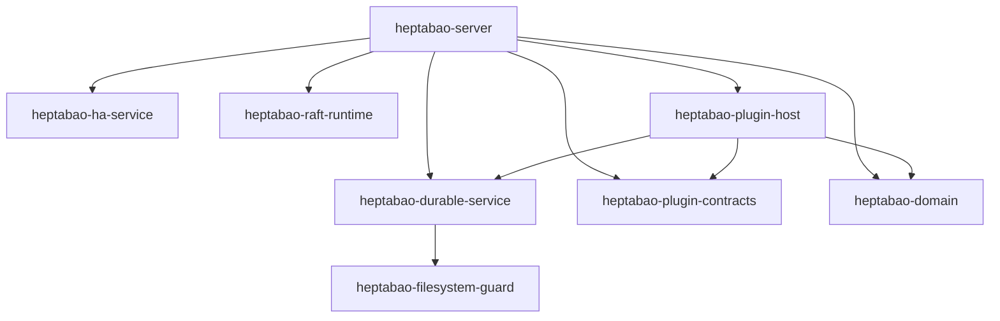
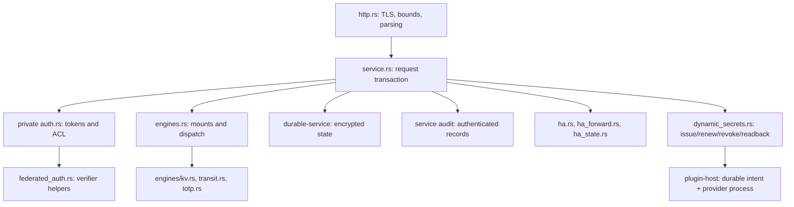

# Current runnable architecture and state ownership

Current plan: `HEPTABAO-PLAN-2026-09-07-V2.1`. This source-level map is for the current runnable candidate. [The complete 46-package map](../modules/CURRENT_RUNTIME_MAP.md) distinguishes the eight runtime packages from the 38 separate contracts, prototypes and tools. See [current source binding](../modules/CURRENT_SOURCE_BINDING.md) for content digests and the historical snapshot boundary. No diagram confers qualification or compatibility authority.

## Actual workspace dependency graph

These are normal Cargo path dependencies, including the transitive directory guard. They are not a plan to rename the other packages into missing layers.

`ha-service` provides the concrete mutually authenticated peer transport and certificate binding consumed by the server. Its generic `HaService` facade is a separate model. `raft-runtime::ProcessRaftNode` provides one voter per process; `RaftRuntime` also retains a three-voter in-process test facade. Compiling those packages does not mean a single-node server automatically runs HA: operators must explicitly supply HA configuration and admit the cluster/key identity.

## Actual server modules and request ownership

TLS parsing is followed by service admission. The service serializes mutable state, obtains and consumes a request-scoped private `Principal`, and rechecks authorization with the live `now`. Neither `AuthState` nor `Principal` is exported. Public Rust callers enter `Service::handle` or `handle_at`; only deterministic tests or a trusted embedding should supply the latter's clock. A normal request owns its JSON body; secret-bearing request/response data is cleared on the relevant drop paths with documented best-effort limits.

Audit is part of admission and response publication: a request record is persisted before dispatch, and a response record before releasing the result. Finite-use token consumption is itself persisted before dispatch. A later denied or failed operation can therefore have consumed the admitted use. A response/audit or transport failure is not evidence that the preceding state mutation did not commit. Parsing/rate-limit rejection records use the separate wire-rejection path; no claim is made that every failed TLS handshake can be audited as an application request.

## Current authoritative writers

| State | Actual owner and durable boundary | Route/verification entry |
|---|---|---|
| Tokens, password/role verifiers, ACL and auth mounts | private `auth.rs`, contained in Service state and encrypted by `durable-service` | `auth/*`, `sys/auth`, `sys/policies/acl/*`; `auth_tests.rs` |
| KV versions/metadata, Transit keys and TOTP state | `engines.rs` and `engines/*`, inside the same encrypted Service state | mount-relative engine routes and `sys/mounts`; `engine_tests.rs` |
| Init/seal/rekey state | `service.rs` seal metadata and optional client-secret initialization recovery object; `crypto.rs` Shamir/key wrapping; barrier activation authenticates durable state | `sys/init`, root `sys/init/ack`, `sys/unseal`, `sys/seal`, `sys/rekey/*`; `service_tests.rs` |
| Durable request ledger, journal and snapshot | `durable-service`; exclusive `filesystem-guard` owner | Service persistence, `sys/internal/recovery/*`, compaction/backup routes; durable-service tests |
| Audit sequence, HMAC chain and rotation checkpoint | service audit owner, private key and independently synchronized JSONL/manifest files | every admitted request and response; server audit tests |
| Dynamic credential lease state and pending provider invocation | `dynamic_secrets.rs` composes `DurableDynamicSecretBroker`; separate encrypted single-active state directory, checksum-pinned plugin/sandbox | `sys/dynamic-secrets/issue`, lease/operation/pending lookup, root reconciliation, `sys/leases/renew`, `sys/leases/revoke`; plugin-host/server tests |
| HA ordering, log/vote/membership and state-machine apply | `ha.rs` composes per-process `ProcessRaftNode`; peer transport binds certificates and messages | peer listener, forwarding and `sys/storage/raft/*`; HA and raft-runtime tests |

The standalone `token`, `policy`, `kv-engine`, `namespace`, `identity`, `lease`, `key-lifecycle`, `rollback-anchor` and `telemetry` packages are not these server owners. `plugin-host`, `plugin-contracts` and `domain` are now runtime dependencies only for the configured dynamic-secret path. Their other separately tested data models must not be substituted into unrelated current storage, API or security claims. The server integrates one explicitly configured dynamic-secret plugin/lease subsystem, but still does not expose a general OpenBao plugin catalog/backend, a qualified database/cloud provider, KMS auto-unseal provider or remote rollback anchor. Dynamic-secret startup is rejected when HA is configured until a shared strongly consistent lease backend exists.

## Historical and target diagrams

The V1 system-context/crate graph and authoritative ownership map retain proposed layers including package names that were never implemented under those names. The V2 mandatory/admitted/durable pipeline documents describe `RuntimeService`/`ServiceCore` compositions. They remain design and regression context; this document is the current executable assembly. Follow the operator runbook for current startup, audit capacity and backup behavior. Destructive HA, migration, upgrade, external provider and independent security/compatibility qualification remain separate evidence requirements.
