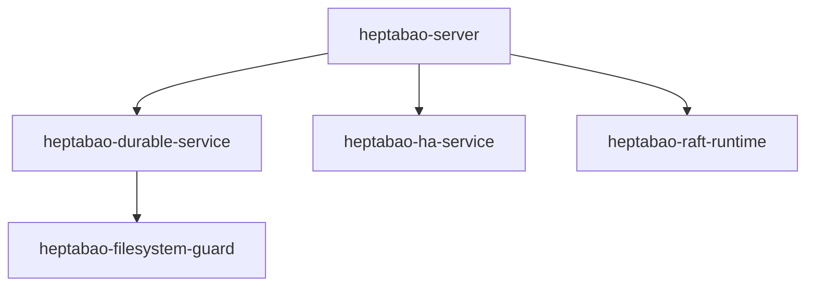
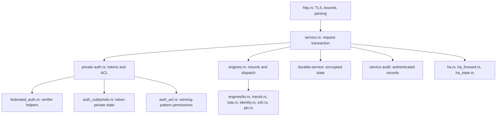

# Current runnable architecture and state ownership

Current plan: `HEPTABAO-PLAN-2026-09-07-V2.1`. This source-level map is for the current runnable candidate. [The complete 46-package map](../modules/CURRENT_RUNTIME_MAP.md) distinguishes the five runtime packages from the 41 separate contracts, prototypes and tools. See [current source binding](../modules/CURRENT_SOURCE_BINDING.md) for content digests and the historical snapshot boundary. No diagram confers qualification or compatibility authority.

## Actual workspace dependency graph

These are normal Cargo path dependencies, including the transitive directory guard. They are not a plan to rename the other packages into missing layers.

`ha-service` provides the concrete mutually authenticated peer transport and certificate binding consumed by the server. Its generic `HaService` facade is a separate model. `raft-runtime::ProcessRaftNode` provides one voter per process; `RaftRuntime` also retains a three-voter in-process test facade. Compiling those packages does not mean a single-node server automatically runs HA: operators must explicitly supply HA configuration and admit the cluster/key identity.

## Actual server modules and request ownership

TLS parsing is followed by service admission. The service serializes mutable state, obtains and consumes a request-scoped private `Principal`, and rechecks authorization with the live `now`. HTTP workers and authenticated HA forwarding now acquire the single Service writer only until an explicit deadline; a slow in-flight provider or persistence operation can still serialize subsequent stateful work, but it cannot make another request wait on the mutex without bound. Deadline expiry returns 503 without entering Service dispatch. Neither `AuthState` nor `Principal` is exported. Public Rust callers enter `Service::handle` or `handle_at`; only deterministic tests or a trusted embedding should supply the latter's clock. A normal request owns its JSON body; secret-bearing request/response data is cleared on the relevant drop paths with documented best-effort limits.

Audit is part of admission and response publication: a request record is persisted before dispatch, and a response record before releasing the result. The mandatory authenticated file device remains the durable local owner. An optional process-configured HTTP audit collector may additionally be installed only through the pre-unseal host egress allowlist; each record is fsynced locally before one no-retry HTTPS delivery, and collector failure fences audit admission until restart/recovery. Runtime API calls may inspect but cannot redirect or replace that collector. Finite-use token consumption is itself persisted before dispatch. A later denied or failed operation can therefore have consumed the admitted use. A response/audit or transport failure is not evidence that the preceding state mutation did not commit. Parsing/rate-limit rejection records use the separate wire-rejection path; no claim is made that every failed TLS handshake can be audited as an application request.

## Current authoritative writers

| State | Actual owner and durable boundary | Route/verification entry |
|---|---|---|
| Tokens, password/role verifiers, ACL and auth mounts | private `auth.rs`, contained in Service state and encrypted by `durable-service` | `auth/*`, `sys/auth`, `sys/policies/acl/*`; `auth_tests.rs` |
| KV versions/metadata, Transit/TOTP, bounded SSH OTP and bounded internal PKI state | `engines.rs`, `engines/*` and `engine_leases.rs`, inside the same encrypted Service state | mount-relative engine routes, `sys/mounts`, `sys/leases/*`; engine/SSH/PKI service tests |
| Token-private Cubbyhole | `Token.cubbyhole` in private AuthState, in the same encrypted Service state; final-use erasure is committed at authentication admission | `cubbyhole/*`; `auth_cubbyhole_tests.rs`, `cubbyhole_service_tests.rs` |
| Entities, aliases, live internal-group policies and merge lineage | `NamespaceState.identity` inside EngineState and the same Service transaction; the Service additionally binds login identities and projects live internal-group policies; complete MFA/OIDC remain separate | `identity/*`; `engines/identity.rs` tests |
| Init/seal/rekey state | `service.rs` seal metadata and optional client-secret initialization recovery object; `crypto.rs` Shamir/key wrapping; barrier activation authenticates durable state | `sys/init`, root `sys/init/ack`, `sys/unseal`, `sys/seal`, `sys/rekey/*`; `service_tests.rs` |
| Durable request ledger, journal and snapshot | `durable-service`; exclusive `filesystem-guard` owner | Service persistence, `sys/internal/recovery/*`, compaction/backup routes; durable-service tests |
| Audit sequence, HMAC chain and rotation checkpoint | service audit owner, private key and independently synchronized JSONL/manifest files | every admitted request and response; server audit tests |
| HA ordering, log/vote/membership and state-machine apply | `ha.rs` composes per-process `ProcessRaftNode`; peer transport binds certificates and messages | peer listener, forwarding, authenticated `sys/step-down` and `sys/storage/raft/*`; HA and raft-runtime tests |

The standalone `token`, `policy`, `kv-engine`, `namespace`, `identity`, `lease`, `plugin-host`, `key-lifecycle`, `rollback-anchor` and `telemetry` packages are not these server owners. Their separately tested data models must not be substituted into a current storage, API or security claim. In particular the server does not yet integrate a general plugin backend, dynamic-secret lease subsystem, KMS auto-unseal provider or remote rollback anchor merely because corresponding crates exist.

## Historical and target diagrams

The V1 system-context/crate graph and authoritative ownership map retain proposed layers including package names that were never implemented under those names. The V2 mandatory/admitted/durable pipeline documents describe `RuntimeService`/`ServiceCore` compositions. They remain design and regression context; this document is the current executable assembly. Follow the operator runbook for current startup, audit capacity and backup behavior. Destructive HA, migration, upgrade, external provider and independent security/compatibility qualification remain separate evidence requirements.

## Core isolation implementation detail

The [Cubbyhole contract](../engines/HEPTABAO_CUBBYHOLE.md) specifies current per-token state, final-use admission, explicit revoke/tidy cleanup and retention limitations. The [server Identity contract](../engines/HEPTABAO_IDENTITY_RUNTIME.md) documents structural Identity plus bounded login/entity/internal-group policy composition; complete MFA and OIDC integration remain unfinished. ACL rules are selected by highest-priority matching pattern; only identical winning patterns union. Parameter-constrained policies remain separate work.

## Current wrapping, inspection and dynamic OTP assembly

`http` passes a typed `ServiceRequest` with optional wrapping TTL. `Service`
reconciles wrapper/lease expiry and issuer liveness against the current ReadIndex
snapshot, durably admits finite bearer use, and dispatches an isolated candidate.
`auth_wrapping` owns encrypted captured responses, `service_capabilities` reads
current ACL/Identity projections, and `engines/ssh` with `engine_leases` owns the
online OTP profile. Result audit and durable publication precede response release.
HBFQ2 carries wrapping options without downgrade. These are internal modules of
`heptabao-server`; the five-package normal Cargo dependency closure is unchanged.

The real Python transport/CLI lives in `clients/python`; QA imports that transport.
It is a separate language package, not an additional Cargo crate and not a daemon.
All current boundaries, capacity limits and unqualified surfaces are documented in
`docs/auth/HEPTABAO_RESPONSE_WRAPPING.md`, `docs/auth/HEPTABAO_CAPABILITIES.md`,
`docs/engines/HEPTABAO_SSH_OTP.md` and `clients/python/README.md`.

## Idle lifecycle and real operational clients

`service_lifecycle.rs` performs bounded local OTP/wrapper expiry through the same
single authoritative Service writer and HA commit path. It has no remotely selected
clock. The bounded PostgreSQL lifecycle is now composed through the same Service
writer; this does not provide a general provider callback registry. The Python `agent`, `proxy` and
`ssh_helper` process entry points make actual verified HTTPS calls, with an AppRole
pending checkpoint/token sink, a Linux same-UID Unix listener, and explicit host/user/
role verification respectively. Their protocol/operations/remaining boundaries are
in `docs/operations/HEPTABAO_AGENT_PROXY_HELPER.md`. The existing Rust agent/proxy
model crates remain outside the normal server closure; no package-count inference
is made. Service schema is 4; [current format and rollback rules](HEPTABAO_CURRENT_STATE_FORMAT.md) supersede earlier increment descriptions. Mixed-version HA is not qualified.

## Current PKI, JWKS and explicit leadership-transfer increment

The current server source additionally integrates a bounded internal PKI engine,
inline public-only JWKS parsing for the existing JWT verifier profile, and an
authenticated `sys/step-down` route backed by OpenRaft leadership transfer. The
step-down path requires both `update` and `sudo`, refuses non-HA use, and waits
for observation of a different leader before success. The loopback three-voter
fixture proves explicit transfer and forwarding after the old leader becomes a
standby; it does not establish mixed-version rolling upgrade or multi-host WAN
qualification. The PKI and JWKS boundaries are documented in the engine/auth
guides and remain narrower than the full OpenBao surfaces.

## Schema 4 external-effect and Raft-administration boundaries

Service now composes the native TLS/SCRAM PostgreSQL adapter and a bounded encrypted provider-intent ledger, fresh remote JWT key resolution, plus native Raft administration. The architecture remains one authoritative Service writer; provider operations require pre-entry intent and post-commit readback, and native consensus owns membership. Host startup pins outbound origins/addresses/CAs. See [PostgreSQL](../engines/HEPTABAO_POSTGRESQL_PROVIDER.md), [remote JWT](../auth/HEPTABAO_REMOTE_JWT_KEYS.md), and [Raft](../operations/HEPTABAO_RAFT_ADMINISTRATION.md). Model-provider tests are not actual SQL execution. These additions do not turn isolated contract crates into runtime dependencies or confer full compatibility.

## Current online authentication increment

[Online Kubernetes / OIDC authentication](../auth/HEPTABAO_ONLINE_AUTHENTICATION.md) adds actual Service-owned
TokenReview and confidential authorization-code/S256 PKCE sessions, plus a native
loopback callback CLI. The separate remote-JWT profile above remains a bearer
verifier, not code flow. Current application writes use schema 6. The new profiles
retain root-controlled enrollment, live Identity, audit and durable/HA publication.
They do not implement complete auth/MFA/browser UI compatibility, scalable storage,
independent acceptance or production authority.
